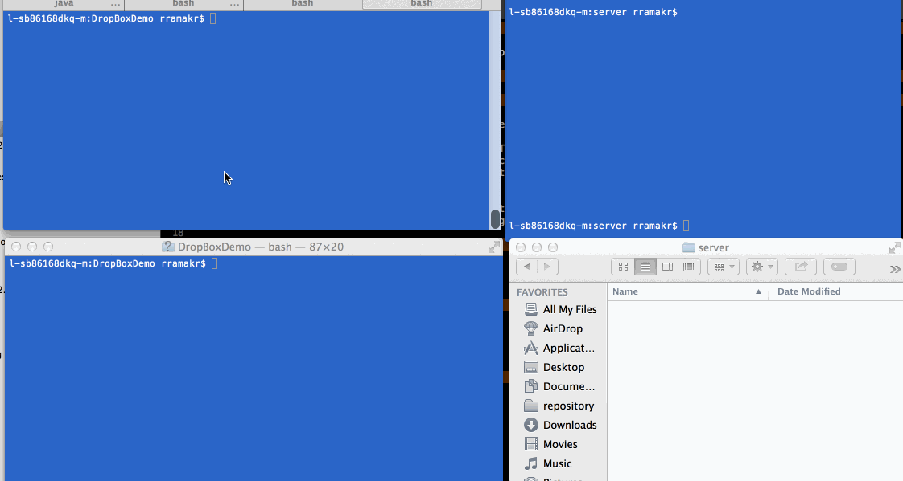

## DropBoxDemo [(raw)](https://gist.github.com/CrabDude/040af9c1b93e350608ff/raw)

This is a basic Dropbox clone to sync files across multiple remote folders.

Time spent: `<Number of hours spent>`

### Features

#### Required

- [x] Client can make GET requests to get file or directory contents
- [x] Client can download a directory as an archive
- [x] Client can make HEAD request to get just the GET headers
- [x] Client can make PUT requests to create new directories and files with content
- [x] Client can make POST requests to update the contents of a file
- [x] Client can make DELETE requests to delete files and folders
- [x] Server will serve from `--dir` or cwd as root
- [x] Server will sync `HTTP` modifications over TCP to the Client
- [x] Server will sync watched file modifications (e.g., `fs.watch`) over TCP to the Client

### Walkthrough

`<Add your Walkthrough Gif here (by updating the image URL)>`

